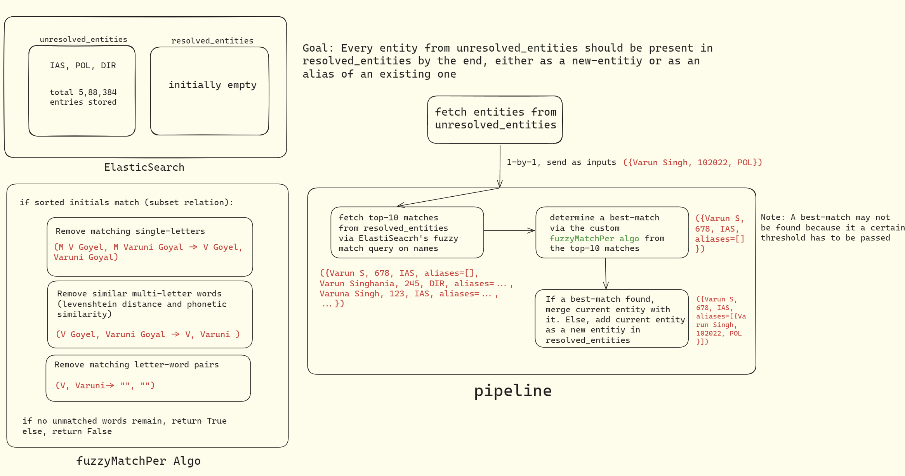

<h1>File Descriptions </h1>

<ol>
  <li>ConvertEntitiesToCSV.py: Used for exporting records from Elasticsearch index to a CSV file</li>
  <li>push_entities.py: Used for configuring and uploading data to Elasticsearch indices </li>
  <li>ER.py: Contains the core logic and checks for entity resolution</li>
  <li>elastic.py: Contains all Elasticsearch helper functions</li>
  <li>main.py: Runs the pipeline, deduplicating unresolved_entities_index into resolved_entities_index</li>
</ol>

